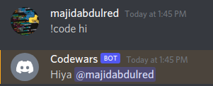
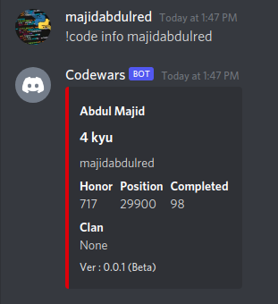
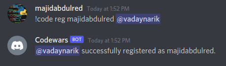
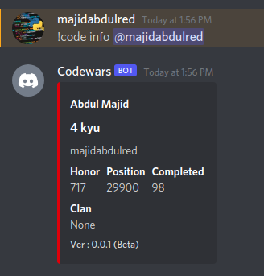
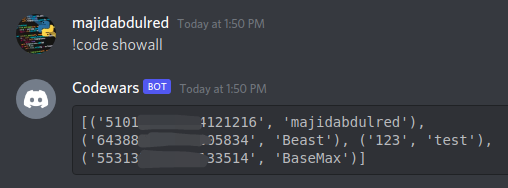
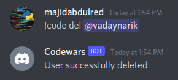

CodeBot
==========

-blue.svg)

A discord bot integrated with [Codewars](https://dev.codewars.com/#users-api) api .

Feature
-------------
* Get codewars profile details by using username
* Get codewars profile details by just mentioning the user

Commands
--------
* `!code hi`
  

* `!code info <codewars_username>`

* `!code reg <username> <@mention>` => Registers the user to database. Here `username` is codewars username of the member.

* `!code info <@mention>` => If the member is registered in the database you can just get details by mentioning the member.

* `!code showall` => To view the Table in the database.

* `!code del <@mention>` => To delete the user from the database.

Deploy
------
This app can be easily deployed to heroku.
Firstly you need to create a discord bot at [Discord Developer portel](https://discord.com/developers/applications). You can use [this tutorial](https://discordpy.readthedocs.io/en/latest/discord.html) for help. Keep the bot token in handy . Now..

* Fork this repo to your Github account.
* Visit [heroku](https://dashboard.heroku.com/) . Create an app.
* Go to Deploy > Deployment method . Click on "Connect to Github" to link your github account.
* Go to Connect to github section. Select your account and write codebot in the search box. Click on search.
* A repo will appear below . Click on connect.
* Scroll below and click on 'Deploy'.
* Go to Settings > Config vars > Reveal Config vars. Write `DISCORD_TOKEN` in `KEY` and paste the Bot token obtained from discord portal in the `VALUE`
* Go to resources > Add-ons and search for heroku postgres. Add it to your app (no credit card needed).
* Go to resources > Free Dyno . Turn on the * Go to resources > Free Dyno . Turn on the `worker python launcher.py`.
* Your app is live.

